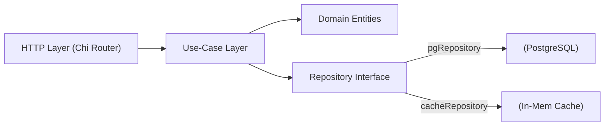

# Go-TinyURL

## TL;DR

**Go‑TinyURL** is an ultra‑minimal URL shortener written in **Go** with **Chi** and **PostgreSQL**. The project highlights clean architecture, concurrent patterns, health‑checks, and essential DevOps practices.

```bash
make dev   # runs docker‑compose + migrations
```

## MVP Features

* Shorten long URLs into compact codes
* Redirect by short code
* Health‑check endpoint `/healthz`
* Data persistence in PostgreSQL (migrations)
* Docker‑compose environment for local development

## Architecture



## Tech Stack

* **Go 1.22**
* **Chi** router
* **golang‑migrate** for migrations
* **PostgreSQL 16**
* **Docker / docker‑compose**
* **GitHub Actions** for CI/CD

## Project Structure

```
cmd/
    server/
internal/
    delivery/http
    usecase
    domain
    repository
    cache
pkg/
    db
configs/
migrations/
docs/
```

## Quick Start

```bash
git clone https://github.com/<username>/go-tinyurl.git
cd go-tinyurl
make dev            # spin up services + run migrations
```

## Roadmap

- TBD

## Contributing

Pull requests are welcome! Before submitting, please run `make lint test`.

## License

MIT
