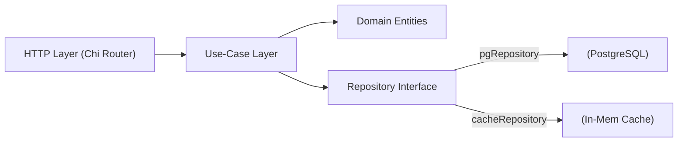

```mermaid
flowchart LR
    UI["HTTP Layer (Chi Router)"]
    USE["Use‑Case Layer"]
    DOM["Domain Entities"]
    REPO["Repository Interface"]
    PG["(PostgreSQL)"]
    CACHE["(In‑Mem Cache)"]
    UI --> USE
    USE --> DOM
    USE --> REPO
    REPO -->|pgRepository| PG
    REPO -->|cacheRepository| CACHE
```